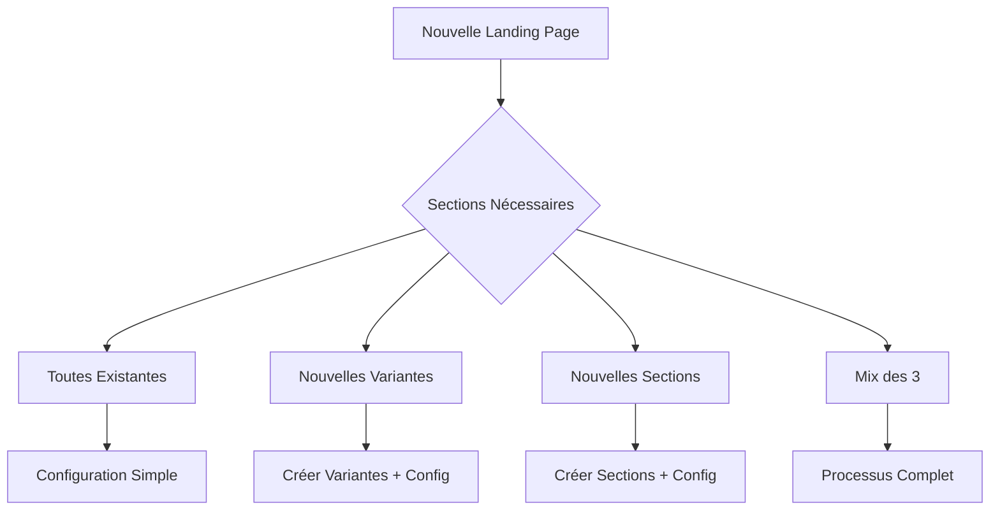

# Manuel de Procédure - Ajout d'une Nouvelle Landing Page

## Table des Matières
1. Vue d'Ensemble du Processus
2. Cas 1 : Landing Page avec Sections Existantes
3. Cas 2 : Landing Page avec Nouvelles Variantes
4. Cas 3 : Landing Page avec Nouvelles Sections
5. Cas 4 : Landing Page Hybride (Mix de Tout)
6. Validation et Tests
7. Déploiement et Mise en Production
8. Troubleshooting Courant

---

## 1. Vue d'Ensemble du Processus

### Principe Central
Créer une nouvelle landing page consiste à **assembler des sections** (existantes ou nouvelles) dans une **configuration déclarative**. Notre architecture permet 4 scénarios principaux :



### Matrice de Complexité

| Scénario | Temps Estimé | Complexité | Fichiers Touchés |
|----------|-------------|------------|-------------------|
| **Cas 1** : Sections existantes | 30 min | 🟢 Facile | 2-3 fichiers |
| **Cas 2** : Nouvelles variantes | 2-4h | 🟡 Moyen | 5-8 fichiers |
| **Cas 3** : Nouvelles sections | 1-2 jours | 🟠 Difficile | 10+ fichiers |
| **Cas 4** : Mix complet | 2-3 jours | 🔴 Complexe | 15+ fichiers |

### Checklist Générale

- [ ] **Analyse** : Identifier les sections nécessaires
- [ ] **Vérification** : Checker si sections/variantes existent
- [ ] **Planification** : Estimer le travail selon la matrice
- [ ] **Développement** : Suivre la procédure du cas approprié
- [ ] **Tests** : Validation locale et visuelle
- [ ] **Documentation** : Mettre à jour ce manuel si nécessaire

---

## 2. Cas 1 : Landing Page avec Sections Existantes

**Scénario** : Vous voulez créer une nouvelle landing page PACFR v3 en utilisant uniquement des sections qui existent déjà.

### 2.1 Analyse Préliminaire

#### Étape 1 : Inventaire des Sections Disponibles
```bash
# Lister toutes les sections disponibles
ls src/sections/
```

Résultat typique :
```
Header/           # ✅ Disponible
GovSubsidy/       # ✅ Disponible  
HeroSection.astro # ✅ Disponible
ReviewsCarousel.astro # ✅ Disponible
Testimonials/     # ✅ Disponible
ContactForm.astro # ✅ Disponible
Footer/           # ✅ Disponible
```

#### Étape 2 : Vérifier les Variantes Disponibles
```typescript
// Vérifier dans src/sections/Header/factory.ts
export const VariantsRegistry = {
    v1: { component: V1, propsFactory: buildV1Props },
    v2: { component: V2, propsFactory: buildV2Props }, // ✅ v2 existe
} as const;
```

#### Étape 3 : Vérifier le Support du Thème
```typescript
// Vérifier dans src/content/header/header-content.v1.ts
export const ContentByTheme = {
    pacfr: { /* ✅ PACFR supporté */ },
    itefr: { /* ✅ ITEFR supporté */ },
    pv: { /* ✅ PV supporté */ }
} as const;
```

### 2.2 Création de la Configuration

#### Étape 1 : Créer le Fichier de Configuration
```bash
# Créer le dossier si nécessaire
mkdir -p src/landings/pacfr

# Créer le fichier de configuration
touch src/landings/pacfr/pacfr-v3.ts
```

#### Étape 2 : Définir la Configuration
```typescript
// src/landings/pacfr/pacfr-v3.ts
export const pacfrV3LandingConfig = {
    meta: {
        title: "PACFR v3 - Nouvelle Landing Page Conversion",
        description: "Landing page optimisée pour la conversion avec nouveau design header",
        keywords: ["rénovation", "aides", "PACFR", "travaux"],
        robots: "index, follow"
    },
    
    sections: [
        // Header avec nouvelle variante v2
        { 
            name: "Header", 
            theme: "pacfr", 
            variant: "v2"  // ← Utilise une variante existante différente
        },
        
        // Hero section simple (pas de thème/variant)
        { 
            name: "HeroSection" 
        },
        
        // Section aides avec variante classique
        { 
            name: "GovSubsidy", 
            theme: "pacfr", 
            variant: "v1" 
        },
        
        // Témoignages avec variante spéciale
        { 
            name: "Testimonials", 
            theme: "pacfr", 
            variant: "v2"  // ← Suppose que v2 existe
        },
        
        // Carousel de reviews simple
        { 
            name: "ReviewsCarousel" 
        },
        
        // Formulaire de contact simple
        { 
            name: "ContactForm" 
        },
        
        // Footer avec thème
        { 
            name: "Footer", 
            theme: "pacfr", 
            variant: "v1" 
        }
    ],
    
    // Configuration additionnelle (optionnel)
    analytics: {
        gtmId: "GTM-PACFR-V3",
        facebookPixel: "123456789",
        conversionGoals: ["form_submit", "phone_click"]
    },
    
    // Variables spécifiques à cette landing (optionnel)
    customization: {
        primaryColor: "#2563eb",  // Bleu spécial pour cette version
        ctaText: "Obtenez Votre Devis Gratuit",
        urgencyMessage: "Offre limitée - Fin le 31 décembre"
    }
} as const;

// Export du type pour TypeScript
export type PacfrV3Config = typeof pacfrV3LandingConfig;
```

### 2.3 Création de la Page Astro

#### Étape 1 : Créer la Page
```bash
# Créer le fichier de page (ou modifier l'existant)
touch src/pages/pacfr/v3.astro
```

#### Étape 2 : Implémenter la Page
```astro
---
// src/pages/pacfr/v3.astro
import { sectionsRegistry } from "@sections/index";
import { pacfrV3LandingConfig } from "@landings/pacfr/pacfr-v3";
import Layout from "@layouts/Layout.astro";

const { meta, sections, customization } = pacfrV3LandingConfig;
---

<Layout 
    title={meta.title}
    description={meta.description}
    keywords={meta.keywords}
    robots={meta.robots}
>
    <!-- CSS Variables personnalisées -->
    <style>
        :root {
            --primary-color: {customization.primaryColor};
            --cta-text: "{customization.ctaText}";
        }
    </style>

    <!-- Rendu dynamique des sections -->
    {sections.map((section, index) => {
        const Component = sectionsRegistry[section.name];
        
        if (!Component) {
            console.error(`❌ Section "${section.name}" not found in registry`);
            return null;
        }
        
        return (
            <Component 
                {...section}
                sectionIndex={index}
                customization={customization}
            />
        );
    })}

    <!-- Scripts d'analytics -->
    <script>
        // Google Tag Manager
        if (typeof gtag !== 'undefined') {
            gtag('config', '{pacfrV3LandingConfig.analytics.gtmId}');
        }
        
        // Facebook Pixel
        if (typeof fbq !== 'undefined') {
            fbq('init', '{pacfrV3LandingConfig.analytics.facebookPixel}');
            fbq('track', 'PageView');
        }
    </script>
</Layout>
```

### 2.4 Tests et Validation

#### Étape 1 : Test Local
```bash
# Démarrer le serveur de développement
npm run dev

# Ouvrir dans le navigateur
open http://localhost:4321/pacfr/v3
```

#### Étape 2 : Checklist de Validation
- [ ] **Affichage** : Toutes les sections s'affichent correctement
- [ ] **Responsive** : Design adapté mobile/tablet/desktop
- [ ] **Performance** : Temps de chargement acceptable
- [ ] **Analytics** : Scripts correctement chargés
- [ ] **SEO** : Meta tags présents et corrects
- [ ] **Accessibilité** : Navigation au clavier fonctionnelle

#### Étape 3 : Test de Conversion
```typescript
// Ajouter des tests de conversion dans la configuration
export const pacfrV3Tests = {
    conversionElements: [
        { element: '[data-testid="cta-button"]', goal: 'main_cta_click' },
        { element: '[data-testid="phone-number"]', goal: 'phone_click' },
        { element: '[data-testid="contact-form"]', goal: 'form_submit' }
    ]
};
```

### 2.5 Documentation de la Landing

#### Créer le README
```markdown
<!-- src/landings/pacfr/README.md -->
# PACFR Landing Pages

## Version 3 (v3)
- **Objectif** : Optimisation conversion avec nouveau header
- **Sections** : Header v2, HeroSection, GovSubsidy v1, Testimonials v2, etc.
- **Spécificités** : Couleur primaire bleue, CTA urgence
- **Tests A/B** : vs v2 (header v1 vs v2)
- **Métriques** : Taux de conversion, temps sur page, bounce rate

## Historique
- v1 : Version originale (Header v1, sections standard)
- v2 : Test avec Testimonials v2
- v3 : Nouveau header v2 + customisation couleur
```

---

## 3. Cas 2 : Landing Page avec Nouvelles Variantes

**Scénario** : Vous voulez créer une landing page ITEFR v2 avec une nouvelle variante de la section Header (Header v3) qui n'existe pas encore.

### 3.1 Analyse et Planification

#### Étape 1 : Identifier les Besoins
```typescript
// Exemple de besoin : Header avec design "premium" pour ITEFR
const headerV3Requirements = {
    design: "Premium avec fond dégradé et animations",
    features: [
        "Animation au scroll",
        "Logos partenaires en carousel",
        "Banner avec countdown",
        "CTA proéminent dans header"
    ],
    responsive: "Mobile-first avec breakpoints custom",
    performance: "Lazy loading des animations"
};
```

#### Étape 2 : Vérifier l'Existant
```bash
# Vérifier les variantes actuelles du Header
cat src/sections/Header/factory.ts | grep -A 5 "VariantsRegistry"
```

Résultat :
```typescript
export const VariantsRegistry = {
    v1: { component: V1, propsFactory: buildV1Props },
    v2: { component: V2, propsFactory: buildV2Props },
    // v3 n'existe pas encore ❌
} as const;
```

### 3.2 Création de la Nouvelle Variante

#### Étape 1 : Analyser les Props Nécessaires
```typescript
// src/sections/Header/factory.ts - Ajouter le type V3
type HeaderV3Props = {
    // Props communes avec v1/v2
    bannerText: string;
    brandLogo: Logo;
    partnerLogos: Array<Logo & { visibilityClass: string }>;
    
    // Props spécifiques à V3
    countdown: {
        endDate: string;
        urgencyText: string;
    };
    ctaButton: {
        text: string;
        href: string;
        variant: "primary" | "secondary";
    };
    animations: {
        enableScrollEffects: boolean;
        logoCarouselSpeed: number;
    };
};
```

#### Étape 2 : Créer le Composant V3
```astro
---
// src/sections/Header/Header.v3.astro
import { Image } from "astro:assets";

const { 
    bannerText, 
    brandLogo, 
    partnerLogos, 
    countdown,
    ctaButton,
    animations 
} = Astro.props as HeaderV3Props;

// Calcul du countdown côté serveur
const now = new Date();
const endDate = new Date(countdown.endDate);
const timeLeft = Math.max(0, endDate.getTime() - now.getTime());
const daysLeft = Math.ceil(timeLeft / (1000 * 60 * 60 * 24));
---

<!-- Header V3 - Design Premium -->
<header class="relative overflow-hidden bg-gradient-to-br from-blue-900 via-blue-700 to-purple-800">
    <!-- Background animé -->
    <div class="absolute inset-0 bg-[url('/patterns/grid.svg')] opacity-10"></div>
    
    <!-- Banner avec countdown -->
    <div class="relative bg-red-600 text-white px-4 py-2">
        <div class="container mx-auto flex items-center justify-between">
            <span class="text-sm font-medium">{bannerText}</span>
            <div class="flex items-center gap-2 text-sm font-bold">
                <span>{countdown.urgencyText}</span>
                <span class="bg-white text-red-600 px-2 py-1 rounded">
                    {daysLeft} jours restants
                </span>
            </div>
        </div>
    </div>

    <!-- Header principal -->
    <div class="relative z-10 container mx-auto px-4 py-6">
        <div class="flex flex-col lg:flex-row items-center justify-between gap-6">
            
            <!-- Logo et branding -->
            <div class="flex flex-col items-center lg:items-start text-center lg:text-left text-white">
                <Image 
                    src={brandLogo.file} 
                    alt={brandLogo.name} 
                    class={`${brandLogo.className} filter brightness-0 invert mb-4`}
                />
                <h1 class="text-2xl lg:text-3xl font-bold mb-2">
                    Isolation Thermique Extérieure
                </h1>
                <p class="text-blue-100 text-lg">
                    Expertise certifiée RGE - Devis gratuit en 24h
                </p>
            </div>

            <!-- CTA proéminent -->
            <div class="flex flex-col items-center gap-4">
                <a 
                    href={ctaButton.href}
                    class={`
                        px-8 py-4 rounded-lg font-bold text-lg transition-all duration-300
                        ${ctaButton.variant === 'primary' 
                            ? 'bg-orange-500 hover:bg-orange-600 text-white shadow-lg hover:shadow-xl transform hover:scale-105' 
                            : 'bg-white hover:bg-gray-100 text-blue-900 shadow-lg hover:shadow-xl'
                        }
                    `}
                    data-testid="header-cta"
                >
                    {ctaButton.text}
                </a>
                
                <!-- Logos partenaires en carousel -->
                <div class="flex items-center gap-4 mt-4">
                    <span class="text-blue-200 text-sm">Certifié par :</span>
                    <div 
                        class="flex gap-3"
                        data-carousel-speed={animations.logoCarouselSpeed}
                    >
                        {partnerLogos.map((logo, index) => (
                            <div 
                                class={`${logo.visibilityClass} opacity-80 hover:opacity-100 transition-opacity`}
                                style={`animation-delay: ${index * 0.5}s`}
                            >
                                <Image 
                                    src={logo.file} 
                                    alt={logo.name} 
                                    class="h-8 filter brightness-0 invert"
                                />
                            </div>
                        ))}
                    </div>
                </div>
            </div>
        </div>
    </div>

    <!-- Animations JavaScript -->
    {animations.enableScrollEffects && (
        <script>
            // Animation au scroll
            window.addEventListener('scroll', () => {
                const header = document.querySelector('header');
                const scrolled = window.scrollY > 100;
                
                if (scrolled) {
                    header.classList.add('scrolled');
                } else {
                    header.classList.remove('scrolled');
                }
            });

            // Carousel des logos
            const carousel = document.querySelector('[data-carousel-speed]');
            if (carousel) {
                const speed = carousel.dataset.carouselSpeed || 3000;
                // Logique de carousel...
            }
        </script>
    )}
</header>

<style>
    header.scrolled {
        @apply bg-opacity-95 backdrop-blur-md;
        transform: translateY(-10px);
        box-shadow: 0 10px 25px rgba(0,0,0,0.1);
    }
    
    @keyframes fadeInUp {
        from {
            opacity: 0;
            transform: translateY(30px);
        }
        to {
            opacity: 1;
            transform: translateY(0);
        }
    }
    
    [data-carousel-speed] > div {
        animation: fadeInUp 0.6s ease-out forwards;
    }
</style>
```

#### Étape 3 : Créer la Props Factory V3
```typescript
// src/sections/Header/factory.ts - Ajouter la factory V3
import { ContentByTheme } from "@content/header/header-content.v1";

export const buildV3Props = (theme: Theme): HeaderV3Props => {
    const content = ContentByTheme[theme];
    
    // Configuration spécifique V3 par thème
    const v3ConfigByTheme = {
        pacfr: {
            countdown: {
                endDate: "2024-12-31T23:59:59",
                urgencyText: "Offre limitée !"
            },
            ctaButton: {
                text: "Devis Gratuit Immédiat",
                href: "/devis",
                variant: "primary" as const
            }
        },
        itefr: {
            countdown: {
                endDate: "2024-12-31T23:59:59", 
                urgencyText: "Promo isolation !"
            },
            ctaButton: {
                text: "Étude Gratuite ITE",
                href: "/etude-ite",
                variant: "primary" as const
            }
        },
        pv: {
            countdown: {
                endDate: "2024-12-31T23:59:59",
                urgencyText: "Crédit d'impôt !"
            },
            ctaButton: {
                text: "Simulation Solaire",
                href: "/simulation",
                variant: "secondary" as const
            }
        }
    };
    
    const v3Config = v3ConfigByTheme[theme];
    
    return {
        // Props communes des autres variantes
        bannerText: content.bannerText,
        brandLogo: content.brandLogo,
        partnerLogos: content.partnerLogos.map(logo => ({
            ...logo,
            visibilityClass: getVisibilityClass(logo.visibleAbove ?? "desktop")
        })),
        
        // Props spécifiques V3
        countdown: v3Config.countdown,
        ctaButton: v3Config.ctaButton,
        animations: {
            enableScrollEffects: true,
            logoCarouselSpeed: 3000
        }
    };
};
```

#### Étape 4 : Enregistrer la Variante
```typescript
// src/sections/Header/factory.ts - Mettre à jour le registry
import V3 from "./Header.v3.astro";

export const VariantsRegistry = {
    v1: { component: V1, propsFactory: buildV1Props },
    v2: { component: V2, propsFactory: buildV2Props },
    v3: { component: V3, propsFactory: buildV3Props }, // ✅ Nouvelle variante ajoutée
} as const;
```

### 3.3 Extension du Contenu (si nécessaire)

#### Étape 1 : Vérifier si Extension Nécessaire
```typescript
// Si V3 a besoin de données spéciales non présentes dans ContentByTheme
const additionalV3Content = {
    itefr: {
        // Contenu supplémentaire pour ITEFR V3
        testimonialQuote: "Isolation parfaite, équipe professionnelle !",
        certificationBadges: [
            { name: "RGE 2024", icon: "rge-2024.svg" },
            { name: "Qualibat", icon: "qualibat.svg" }
        ]
    }
};
```

#### Étape 2 : Étendre ContentByTheme (optionnel)
```typescript
// src/content/header/header-content.v1.ts
export const ContentByTheme = {
    itefr: {
        // Contenu existant
        bannerText: "Isolation thermique extérieure - Expertise certifiée",
        brandLogo: { name: "ITE FRANCE", file: itefrLogo, className: "h-14" },
        partnerLogos: [/*...*/],
        
        // ✅ Contenu spécifique V3
        v3Extras: {
            testimonialQuote: "Isolation parfaite, équipe professionnelle !",
            certificationBadges: [
                { name: "RGE 2024", icon: "rge-2024.svg" },
                { name: "Qualibat", icon: "qualibat.svg" }
            ],
            urgencySettings: {
                showCountdown: true,
                promoEndDate: "2024-12-31",
                urgencyLevel: "high"
            }
        }
    }
    // ... autres thèmes
};
```

### 3.4 Création de la Landing Page

#### Configuration de la Landing
```typescript
// src/landings/itefr/itefr-v2.ts
export const itefrV2LandingConfig = {
    meta: {
        title: "ITE France v2 - Isolation Premium avec Urgence",
        description: "Nouvelle landing page avec header premium et countdown d'urgence"
    },
    
    sections: [
        // ✅ Utilisation de la nouvelle variante V3
        { 
            name: "Header", 
            theme: "itefr", 
            variant: "v3"  // ← Nouvelle variante créée
        },
        
        { name: "HeroSection" },
        
        // Sections existantes avec variantes testées
        { name: "TechnicalSpecs", theme: "itefr", variant: "v1" },
        { name: "Testimonials", theme: "itefr", variant: "v2" },
        { name: "ContactForm" }
    ]
} as const;
```

#### Page Astro
```astro
---
// src/pages/itefr/v2.astro
import { sectionsRegistry } from "@sections/index";
import { itefrV2LandingConfig } from "@landings/itefr/itefr-v2";
import Layout from "@layouts/Layout.astro";

const { meta, sections } = itefrV2LandingConfig;
---

<Layout 
    title={meta.title}
    description={meta.description}
>
    {sections.map(section => {
        const Component = sectionsRegistry[section.name];
        return <Component {...section} />;
    })}
</Layout>
```

### 3.5 Tests A/B Setup

#### Configuration des Tests
```typescript
// src/landings/itefr/ab-tests.ts
export const itefrABTests = {
    "header-variant-test": {
        name: "Header V2 vs V3 Conversion Test",
        variants: [
            {
                name: "Control (V2)",
                weight: 50,
                config: { name: "Header", theme: "itefr", variant: "v2" }
            },
            {
                name: "Test (V3 Premium)",
                weight: 50, 
                config: { name: "Header", theme: "itefr", variant: "v3" }
            }
        ],
        metrics: ["conversion_rate", "cta_clicks", "time_on_page"],
        duration: "14 days",
        minSampleSize: 1000
    }
};
```

---

## 4. Cas 3 : Landing Page avec Nouvelles Sections

**Scénario** : Vous voulez créer une landing page PV v2 avec une nouvelle section "SolarCalculator" qui n'existe pas du tout.

### 4.1 Analyse et Design

#### Étape 1 : Spécifications de la Nouvelle Section
```typescript
// Cahier des charges pour SolarCalculator
const solarCalculatorSpecs = {
    functionality: [
        "Calcul du potentiel solaire par code postal",
        "Estimation des économies annuelles", 
        "Nombre de panneaux recommandé",
        "Retour sur investissement",
        "Aides disponibles par région"
    ],
    
    inputs: [
        "Code postal",
        "Surface de toit disponible", 
        "Consommation électrique annuelle",
        "Orientation du toit",
        "Inclinaison du toit"
    ],
    
    outputs: [
        "Potentiel de production kWh/an",
        "Économies annuelles €",
        "Nombre de panneaux nécessaires",
        "Coût d'installation estimé",
        "ROI en années"
    ],
    
    design: "Interactive avec graphiques et animations",
    responsive: "Mobile-first avec UX optimisée",
    performance: "Calculs côté client, données en cache"
};
```

### 4.2 Création de la Structure Complète

#### Étape 1 : Créer la Structure de Fichiers
```bash
# Créer le dossier de la nouvelle section
mkdir -p src/sections/SolarCalculator

# Créer tous les fichiers nécessaires
touch src/sections/SolarCalculator/Resolver.astro
touch src/sections/SolarCalculator/SolarCalculator.v1.astro
touch src/sections/SolarCalculator/factory.ts
touch src/sections/SolarCalculator/index.ts

# Créer le contenu associé
mkdir -p src/content/solarCalculator
touch src/content/solarCalculator/content.v1.ts
touch src/content/solarCalculator/types.ts
```

#### Étape 2 : Définir les Types
```typescript
// src/content/solarCalculator/types.ts
export type Theme = "pacfr" | "itefr" | "pv";

export type SolarData = {
    regionCode: string;
    solarIrradiance: number; // kWh/m²/an
    electricityPrice: number; // €/kWh
    subsidyRate: number; // %
};

export type CalculatorContent = {
    title: string;
    subtitle: string;
    form: {
        postalCodeLabel: string;
        postalCodePlaceholder: string;
        roofSurfaceLabel: string;
        roofSurfacePlaceholder: string;
        consumptionLabel: string;
        consumptionPlaceholder: string;
        orientationLabel: string;
        orientationOptions: Array<{ value: string; label: string; }>;
        calculateButtonText: string;
    };
    results: {
        productionLabel: string;
        savingsLabel: string;
        panelsLabel: string;
        costLabel: string;
        roiLabel: string;
        subsidyLabel: string;
    };
    cta: {
        text: string;
        href: string;
    };
};

export type SolarCalculatorV1Props = {
    content: CalculatorContent;
    solarData: Record<string, SolarData>;
    theme: Theme;
};
```

#### Étape 3 : Créer le Contenu par Thème
```typescript
// src/content/solarCalculator/content.v1.ts
import type { Theme, CalculatorContent, SolarData } from "./types";

export const ContentByTheme: Record<Theme, CalculatorContent> = {
    pv: {
        title: "Calculateur Solaire Intelligent",
        subtitle: "Découvrez votre potentiel solaire et vos économies en 2 minutes",
        form: {
            postalCodeLabel: "Votre code postal",
            postalCodePlaceholder: "Ex: 75001",
            roofSurfaceLabel: "Surface de toit disponible (m²)",
            roofSurfacePlaceholder: "Ex: 40",
            consumptionLabel: "Consommation électrique annuelle (kWh)",
            consumptionPlaceholder: "Ex: 3500",
            orientationLabel: "Orientation principale du toit",
            orientationOptions: [
                { value: "south", label: "Sud (optimal)" },
                { value: "southeast", label: "Sud-Est" },
                { value: "southwest", label: "Sud-Ouest" },
                { value: "east", label: "Est" },
                { value: "west", label: "Ouest" }
            ],
            calculateButtonText: "Calculer Mon Potentiel Solaire"
        },
        results: {
            productionLabel: "Production annuelle estimée",
            savingsLabel: "Économies annuelles",
            panelsLabel: "Nombre de panneaux recommandé",
            costLabel: "Investissement estimé",
            roiLabel: "Retour sur investissement",
            subsidyLabel: "Aides disponibles"
        },
        cta: {
            text: "Obtenir Un Devis Personnalisé",
            href: "/devis-solaire"
        }
    },
    
    pacfr: {
        title: "Simulateur Panneaux Solaires",
        subtitle: "Calculez vos aides et économies avec les panneaux solaires",
        // ... contenu adapté PACFR
        form: {
            postalCodeLabel: "Code postal",
            postalCodePlaceholder: "Votre code postal",
            // ... rest adapté
            calculateButtonText: "Simuler Mes Aides Solaires"
        },
        cta: {
            text: "Demander Mes Aides Solaires",
            href: "/aides-solaires"
        }
        // ... rest du contenu
    },
    
    itefr: {
        // Section calculateur pas forcément pertinente pour ITE
        // mais on peut l'adapter pour calcul d'économies isolation
        title: "Calculateur d'Économies ITE",
        subtitle: "Estimez vos économies avec l'isolation thermique extérieure",
        // ... contenu adapté ITE
    }
} as const;

// Données de référence par région
export const SolarDataByRegion: Record<string, SolarData> = {
    "75": { // Paris
        regionCode: "IDF",
        solarIrradiance: 1100,
        electricityPrice: 0.1740,
        subsidyRate: 0.20
    },
    "69": { // Lyon  
        regionCode: "ARA",
        solarIrradiance: 1300,
        electricityPrice: 0.1740,
        subsidyRate: 0.25
    },
    "13": { // Marseille
        regionCode: "PACA", 
        solarIrradiance: 1600,
        electricityPrice: 0.1740,
        subsidyRate: 0.30
    }
    // ... autres régions
};
```

#### Étape 4 : Créer la Factory
```typescript
// src/sections/SolarCalculator/factory.ts
import { ContentByTheme, SolarDataByRegion } from "@content/solarCalculator/content.v1";
import type { Theme, SolarCalculatorV1Props } from "@content/solarCalculator/types";
import V1 from "./SolarCalculator.v1.astro";

/**
 * Factory qui construit les props pour le composant SolarCalculator variant v1
 * 
 * @param theme - Le thème de la marque
 * @returns Props typées pour SolarCalculator.v1.astro
 */
export const buildV1Props = (theme: Theme): SolarCalculatorV1Props => {
    return {
        content: ContentByTheme[theme],
        solarData: SolarDataByRegion,
        theme
    };
};

/**
 * Registre des variants SolarCalculator
 */
export const VariantsRegistry = {
    v1: { component: V1, propsFactory: buildV1Props }
} as const;

/**
 * Résout un variant de SolarCalculator
 */
export const resolveVariant = (variant: string = "v1") => {
    return VariantsRegistry[variant as keyof typeof VariantsRegistry] ?? VariantsRegistry.v1;
};
```

#### Étape 5 : Créer le Composant UI
```astro
---
// src/sections/SolarCalculator/SolarCalculator.v1.astro
import type { SolarCalculatorV1Props } from "@content/solarCalculator/types";

const { content, solarData, theme } = Astro.props as SolarCalculatorV1Props;
---

<section class="py-16 bg-gradient-to-br from-yellow-50 to-orange-50" data-section="solar-calculator">
    <div class="container mx-auto px-4">
        
        <!-- Header -->
        <div class="text-center mb-12">
            <h2 class="text-4xl font-bold text-gray-900 mb-4">
                {content.title}
            </h2>
            <p class="text-xl text-gray-600 max-w-3xl mx-auto">
                {content.subtitle}
            </p>
        </div>

        <!-- Calculateur interactif -->
        <div class="max-w-4xl mx-auto">
            <div class="bg-white rounded-2xl shadow-xl overflow-hidden">
                
                <!-- Formulaire -->
                <div class="p-8 bg-gradient-to-r from-blue-600 to-purple-600 text-white">
                    <form id="solar-calculator-form" class="grid md:grid-cols-2 gap-6">
                        
                        <!-- Code postal -->
                        <div>
                            <label class="block text-sm font-medium mb-2">
                                {content.form.postalCodeLabel}
                            </label>
                            <input 
                                type="text" 
                                name="postalCode"
                                placeholder={content.form.postalCodePlaceholder}
                                class="w-full px-4 py-3 rounded-lg text-gray-900 border-0 focus:ring-2 focus:ring-yellow-400"
                                required
                            />
                        </div>

                        <!-- Surface toit -->
                        <div>
                            <label class="block text-sm font-medium mb-2">
                                {content.form.roofSurfaceLabel}
                            </label>
                            <input 
                                type="number" 
                                name="roofSurface"
                                placeholder={content.form.roofSurfacePlaceholder}
                                class="w-full px-4 py-3 rounded-lg text-gray-900 border-0 focus:ring-2 focus:ring-yellow-400"
                                min="10"
                                max="500"
                                required
                            />
                        </div>

                        <!-- Consommation -->
                        <div>
                            <label class="block text-sm font-medium mb-2">
                                {content.form.consumptionLabel}
                            </label>
                            <input 
                                type="number" 
                                name="consumption"
                                placeholder={content.form.consumptionPlaceholder}
                                class="w-full px-4 py-3 rounded-lg text-gray-900 border-0 focus:ring-2 focus:ring-yellow-400"
                                min="1000"
                                max="20000"
                                required
                            />
                        </div>

                        <!-- Orientation -->
                        <div>
                            <label class="block text-sm font-medium mb-2">
                                {content.form.orientationLabel}
                            </label>
                            <select 
                                name="orientation"
                                class="w-full px-4 py-3 rounded-lg text-gray-900 border-0 focus:ring-2 focus:ring-yellow-400"
                                required
                            >
                                {content.form.orientationOptions.map(option => (
                                    <option value={option.value}>{option.label}</option>
                                ))}
                            </select>
                        </div>

                        <!-- Bouton de calcul -->
                        <div class="md:col-span-2 pt-4">
                            <button 
                                type="submit"
                                class="w-full bg-yellow-400 hover:bg-yellow-500 text-gray-900 font-bold py-4 px-8 rounded-lg transition-all duration-300 transform hover:scale-105 shadow-lg"
                            >
                                {content.form.calculateButtonText}
                            </button>
                        </div>
                    </form>
                </div>

                <!-- Résultats -->
                <div id="calculator-results" class="p-8 hidden">
                    <h3 class="text-2xl font-bold text-gray-900 mb-6 text-center">
                        Votre Potentiel Solaire
                    </h3>
                    
                    <div class="grid md:grid-cols-3 gap-6 mb-8">
                        <!-- Production -->
                        <div class="text-center p-6 bg-green-50 rounded-xl">
                            <div class="text-3xl font-bold text-green-600 mb-2" id="result-production">
                                -
                            </div>
                            <div class="text-gray-600">{content.results.productionLabel}</div>
                        </div>

                        <!-- Économies -->
                        <div class="text-center p-6 bg-blue-50 rounded-xl">
                            <div class="text-3xl font-bold text-blue-600 mb-2" id="result-savings">
                                -
                            </div>
                            <div class="text-gray-600">{content.results.savingsLabel}</div>
                        </div>

                        <!-- ROI -->
                        <div class="text-center p-6 bg-purple-50 rounded-xl">
                            <div class="text-3xl font-bold text-purple-600 mb-2" id="result-roi">
                                -
                            </div>
                            <div class="text-gray-600">{content.results.roiLabel}</div>
                        </div>
                    </div>

                    <!-- Détails -->
                    <div class="grid md:grid-cols-2 gap-6 mb-8">
                        <div class="bg-gray-50 p-4 rounded-lg">
                            <strong>{content.results.panelsLabel}:</strong>
                            <span id="result-panels" class="ml-2">-</span>
                        </div>
                        <div class="bg-gray-50 p-4 rounded-lg">
                            <strong>{content.results.costLabel}:</strong>
                            <span id="result-cost" class="ml-2">-</span>
                        </div>
                    </div>

                    <!-- CTA -->
                    <div class="text-center">
                        <a 
                            href={content.cta.href}
                            class="inline-flex items-center px-8 py-4 bg-gradient-to-r from-blue-600 to-purple-600 text-white font-bold rounded-lg hover:from-blue-700 hover:to-purple-700 transition-all duration-300 transform hover:scale-105 shadow-lg"
                            data-testid="calculator-cta"
                        >
                            {content.cta.text}
                            <svg class="ml-2 w-5 h-5" fill="none" stroke="currentColor" viewBox="0 0 24 24">
                                <path stroke-linecap="round" stroke-linejoin="round" stroke-width="2" d="M13 7l5 5m0 0l-5 5m5-5H6"></path>
                            </svg>
                        </a>
                    </div>
                </div>
            </div>
        </div>
    </div>
</section>

<!-- JavaScript pour le calculateur -->
<script>
    // Données solaires passées du serveur
    const solarData = JSON.parse(document.querySelector('[data-solar-data]')?.textContent || '{}');
    
    // Facteurs d'orientation
    const orientationFactors = {
        south: 1.0,
        southeast: 0.95,
        southwest: 0.95,
        east: 0.85,
        west: 0.85
    };

    document.getElementById('solar-calculator-form').addEventListener('submit', function(e) {
        e.preventDefault();
        
        // Récupérer les données du formulaire
        const formData = new FormData(e.target);
        const postalCode = formData.get('postalCode').substring(0, 2);
        const roofSurface = parseFloat(formData.get('roofSurface'));
        const consumption = parseFloat(formData.get('consumption'));
        const orientation = formData.get('orientation');
        
        // Calculer les résultats
        const regionData = solarData[postalCode] || solarData['75']; // Fallback Paris
        const orientationFactor = orientationFactors[orientation] || 0.85;
        
        // Calculs
        const panelSurface = 2; // m² par panneau
        const panelPower = 400; // W par panneau
        const maxPanels = Math.floor(roofSurface / panelSurface);
        const neededPanels = Math.min(maxPanels, Math.ceil(consumption / (regionData.solarIrradiance * orientationFactor * panelPower / 1000)));
        
        const production = neededPanels * panelPower * regionData.solarIrradiance * orientationFactor / 1000;
        const savings = Math.min(production, consumption) * regionData.electricityPrice;
        const installCost = neededPanels * 800; // €800 par panneau
        const subsidy = installCost * regionData.subsidyRate;
        const netCost = installCost - subsidy;
        const roi = netCost / savings;
        
        // Afficher les résultats
        document.getElementById('result-production').textContent = Math.round(production).toLocaleString() + ' kWh/an';
        document.getElementById('result-savings').textContent = Math.round(savings).toLocaleString() + ' €/an';
        document.getElementById('result-roi').textContent = Math.round(roi) + ' ans';
        document.getElementById('result-panels').textContent = neededPanels + ' panneaux';
        document.getElementById('result-cost').textContent = Math.round(netCost).toLocaleString() + ' € (après aides)';
        
        // Afficher la section résultats
        document.getElementById('calculator-results').classList.remove('hidden');
        document.getElementById('calculator-results').scrollIntoView({ behavior: 'smooth' });
        
        // Analytics
        if (typeof gtag !== 'undefined') {
            gtag('event', 'solar_calculation', {
                'event_category': 'engagement',
                'event_label': postalCode,
                'value': Math.round(savings)
            });
        }
    });
</script>

<!-- Données solaires pour JavaScript -->
<script type="application/json" data-solar-data>
    {JSON.stringify(solarData)}
</script>
```

#### Étape 6 : Créer le Resolver
```astro
---
// src/sections/SolarCalculator/Resolver.astro
import { resolveVariant } from "./factory";
import { ContentByTheme } from "@content/solarCalculator/content.v1";

const { theme = "pv", variant = "v1" } = Astro.props as {
    theme?: "pacfr" | "itefr" | "pv";
    variant?: string;
};

const { component: Component, propsFactory } = resolveVariant(variant);
const props = propsFactory(theme);
---

<Component {...props} />
```

### 4.3 Intégration dans le Registry Global

#### Étape 1 : Ajouter au Registry des Sections
```typescript
// src/sections/index.ts
import SolarCalculatorResolver from "./SolarCalculator/Resolver.astro";

export const sectionsRegistry = {
    Header: HeaderResolver,
    GovSubsidy: GovSubsidyResolver,
    SolarCalculator: SolarCalculatorResolver, // ✅ Nouvelle section ajoutée
    Testimonials: TestimonialsResolver,
    HeroSection,
    ReviewsCarousel,
    ContactForm,
} as const;
```

### 4.4 Création de la Landing Page PV v2

#### Configuration
```typescript
// src/landings/pv/pv-v2.ts
export const pvV2LandingConfig = {
    meta: {
        title: "PV v2 - Calculateur Solaire Interactif",
        description: "Nouvelle landing page avec calculateur solaire intelligent pour estimer vos économies",
        keywords: ["panneaux solaires", "calculateur", "économies", "simulation"]
    },
    
    sections: [
        { name: "Header", theme: "pv", variant: "v2" },
        { name: "HeroSection" },
        
        // ✅ Utilisation de la nouvelle section
        { name: "SolarCalculator", theme: "pv", variant: "v1" },
        
        { name: "Testimonials", theme: "pv", variant: "v1" },
        { name: "ContactForm" }
    ],
    
    // Configuration spéciale pour le calculateur
    customization: {
        calculatorSettings: {
            enableAdvancedMode: true,
            showRegionalData: true,
            enableComparison: true
        }
    }
} as const;
```

#### Page Astro
```astro
---
// src/pages/pv/v2.astro
import { sectionsRegistry } from "@sections/index";
import { pvV2LandingConfig } from "@landings/pv/pv-v2";
import Layout from "@layouts/Layout.astro";

const { meta, sections, customization } = pvV2LandingConfig;
---

<Layout 
    title={meta.title}
    description={meta.description}
    keywords={meta.keywords}
>
    <!-- CSS pour le calculateur -->
    <style>
        .calculator-section {
            --primary-color: #f59e0b;
            --secondary-color: #3b82f6;
        }
    </style>

    {sections.map(section => {
        const Component = sectionsRegistry[section.name];
        return (
            <Component 
                {...section} 
                customization={customization}
            />
        );
    })}

    <!-- Scripts spéciaux pour le calculateur -->
    <script>
        // Améliorer l'UX du calculateur
        document.addEventListener('DOMContentLoaded', function() {
            // Auto-complétion code postal
            // Validation en temps réel
            // Animations des résultats
        });
    </script>
</Layout>
```

---

## 5. Cas 4 : Landing Page Hybride (Mix de Tout)

**Scénario** : Vous voulez créer une landing page "super-premium" PACFR v4 qui combine :
- Sections existantes (Header, Footer)
- Nouvelles variantes (Testimonials v3 avec vidéos)
- Nouvelles sections (PriceComparison, LiveChat)
- Intégrations avancées (A/B testing, analytics)

### 5.1 Planification Complète

#### Matrice des Besoins
```typescript
const pacfrV4Requirements = {
    existingSections: {
        Header: { variant: "v2", modifications: "Aucune" },
        GovSubsidy: { variant: "v1", modifications: "Aucune" },
        ContactForm: { variant: "v1", modifications: "Aucune" },
        Footer: { variant: "v1", modifications: "Aucune" }
    },
    
    newVariants: {
        Testimonials: {
            currentVersion: "v2",
            newVersion: "v3",
            features: ["Vidéos témoignages", "Ratings interactifs", "Carousel auto"]
        }
    },
    
    newSections: {
        PriceComparison: {
            purpose: "Comparateur de prix vs concurrents",
            complexity: "Moyenne",
            estimatedTime: "1 jour"
        },
        LiveChat: {
            purpose: "Chat en direct avec widget",
            complexity: "Faible",
            estimatedTime: "4 heures"
        }
    },
    
    integrations: {
        analytics: ["GTM", "Facebook Pixel", "HotJar"],
        abTesting: "Custom solution",
        performance: "Lazy loading, critical CSS"
    }
};
```

#### Timeline de Développement
```
Jour 1: Nouvelles variantes (Testimonials v3)
Jour 2: Nouvelle section PriceComparison
Jour 3: Nouvelle section LiveChat + intégrations
Jour 4: Configuration landing + tests
Jour 5: Optimisations + déploiement
```

### 5.2 Développement Étape par Étape

#### Phase 1 : Nouvelle Variante Testimonials v3

```astro
---
// src/sections/Testimonials/Testimonials.v3.astro
const { title, testimonials, videoTestimonials } = Astro.props;
---

<section class="py-16 bg-gray-900 text-white relative overflow-hidden">
    <!-- Background vidéo -->
    <video 
        autoplay 
        muted 
        loop 
        class="absolute inset-0 w-full h-full object-cover opacity-20"
    >
        <source src="/videos/testimonials-bg.mp4" type="video/mp4">
    </video>
    
    <div class="relative z-10 container mx-auto px-4">
        <h2 class="text-4xl font-bold text-center mb-12">{title}</h2>
        
        <!-- Témoignages vidéo -->
        <div class="grid lg:grid-cols-2 gap-8 mb-12">
            {videoTestimonials.map(video => (
                <div class="bg-black bg-opacity-50 rounded-xl p-6 backdrop-blur-sm">
                    <div class="aspect-video mb-4 rounded-lg overflow-hidden">
                        <iframe 
                            src={video.embedUrl}
                            class="w-full h-full"
                            frameborder="0"
                            allow="autoplay; encrypted-media"
                            loading="lazy"
                        ></iframe>
                    </div>
                    <div class="text-center">
                        <h4 class="font-bold text-lg">{video.customerName}</h4>
                        <p class="text-yellow-400">{video.location}</p>
                        <div class="flex justify-center mt-2">
                            {Array.from({length: video.rating}).map(() => (
                                <span class="text-yellow-400">★</span>
                            ))}
                        </div>
                    </div>
                </div>
            ))}
        </div>
        
        <!-- Témoignages texte en carousel -->
        <div class="testimonials-carousel" data-auto-scroll="true">
            <!-- Carousel implementation -->
        </div>
    </div>
</section>
```

#### Phase 2 : Nouvelle Section PriceComparison

```bash
# Créer la structure
mkdir -p src/sections/PriceComparison
touch src/sections/PriceComparison/{Resolver.astro,PriceComparison.v1.astro,factory.ts}

mkdir -p src/content/priceComparison
touch src/content/priceComparison/{content.v1.ts,types.ts}
```

```typescript
// src/content/priceComparison/content.v1.ts
export const ContentByTheme = {
    pacfr: {
        title: "Pourquoi Choisir PACFR ?",
        subtitle: "Comparaison transparente avec nos concurrents",
        
        competitors: [
            { name: "PACFR", logo: pacfrLogo, isUs: true },
            { name: "Concurrent A", logo: competitorALogo, isUs: false },
            { name: "Concurrent B", logo: competitorBLogo, isUs: false }
        ],
        
        criteria: [
            {
                name: "Aides maximales",
                pacfr: { value: "11 500€", highlight: true },
                competitorA: { value: "8 000€", highlight: false },
                competitorB: { value: "9 500€", highlight: false }
            },
            {
                name: "Délai de traitement",
                pacfr: { value: "48h", highlight: true },
                competitorA: { value: "5-7 jours", highlight: false },
                competitorB: { value: "3-5 jours", highlight: false }
            },
            {
                name: "Accompagnement",
                pacfr: { value: "Complet", highlight: true },
                competitorA: { value: "Limité", highlight: false },
                competitorB: { value: "Standard", highlight: false }
            }
        ],
        
        cta: {
            text: "Obtenir Mes Avantages PACFR",
            href: "/avantages-pacfr"
        }
    }
    // ... autres thèmes
};
```

#### Phase 3 : Nouvelle Section LiveChat

```astro
---
// src/sections/LiveChat/LiveChat.v1.astro
const { chatConfig, theme } = Astro.props;
---

<!-- Widget de chat -->
<div 
    id="live-chat-widget"
    class="fixed bottom-6 right-6 z-50"
    data-theme={theme}
>
    <!-- Chat bubble -->
    <button 
        id="chat-trigger"
        class="bg-blue-600 hover:bg-blue-700 text-white p-4 rounded-full shadow-lg transition-all duration-300 transform hover:scale-110"
        data-testid="live-chat-trigger"
    >
        <svg class="w-6 h-6" fill="none" stroke="currentColor" viewBox="0 0 24 24">
            <path stroke-linecap="round" stroke-linejoin="round" stroke-width="2" d="M8 12h.01M12 12h.01M16 12h.01M21 12c0 4.418-4.03 8-9 8a9.863 9.863 0 01-4.255-.949L3 20l1.395-3.72C3.512 15.042 3 13.574 3 12c0-4.418 4.03-8 9-8s9 3.582 9 8z"></path>
        </svg>
        
        <!-- Notification badge -->
        <span class="absolute -top-2 -right-2 bg-red-500 text-white text-xs rounded-full h-6 w-6 flex items-center justify-center animate-pulse">
            1
        </span>
    </button>
    
    <!-- Chat window -->
    <div 
        id="chat-window"
        class="absolute bottom-16 right-0 w-80 h-96 bg-white rounded-lg shadow-xl border hidden"
    >
        <!-- Chat header -->
        <div class="bg-blue-600 text-white p-4 rounded-t-lg flex justify-between items-center">
            <div>
                <h4 class="font-bold">{chatConfig.title}</h4>
                <p class="text-sm opacity-90">{chatConfig.subtitle}</p>
            </div>
            <button id="chat-close" class="text-white hover:text-gray-200">
                <svg class="w-5 h-5" fill="none" stroke="currentColor" viewBox="0 0 24 24">
                    <path stroke-linecap="round" stroke-linejoin="round" stroke-width="2" d="M6 18L18 6M6 6l12 12"></path>
                </svg>
            </button>
        </div>
        
        <!-- Chat messages -->
        <div id="chat-messages" class="p-4 h-64 overflow-y-auto">
            <!-- Messages will be loaded here -->
        </div>
        
        <!-- Chat input -->
        <div class="p-4 border-t">
            <div class="flex gap-2">
                <input 
                    type="text" 
                    id="chat-input"
                    placeholder={chatConfig.inputPlaceholder}
                    class="flex-1 px-3 py-2 border rounded-lg focus:ring-2 focus:ring-blue-500"
                />
                <button 
                    id="chat-send"
                    class="bg-blue-600 text-white px-4 py-2 rounded-lg hover:bg-blue-700"
                >
                    Envoyer
                </button>
            </div>
        </div>
    </div>
</div>

<script>
    // Chat functionality
    class LiveChat {
        constructor() {
            this.isOpen = false;
            this.messages = [];
            this.init();
        }
        
        init() {
            // Event listeners
            document.getElementById('chat-trigger').addEventListener('click', () => this.toggle());
            document.getElementById('chat-close').addEventListener('click', () => this.close());
            document.getElementById('chat-send').addEventListener('click', () => this.sendMessage());
            
            // Auto-open after delay
            setTimeout(() => this.showNotification(), 10000);
        }
        
        toggle() {
            const window = document.getElementById('chat-window');
            if (this.isOpen) {
                window.classList.add('hidden');
                this.isOpen = false;
            } else {
                window.classList.remove('hidden');
                this.isOpen = true;
                this.loadWelcomeMessage();
            }
        }
        
        loadWelcomeMessage() {
            const welcomeMessage = {
                type: 'bot',
                text: 'Bonjour ! Comment puis-je vous aider avec vos travaux de rénovation ?',
                timestamp: new Date()
            };
            this.addMessage(welcomeMessage);
        }
        
        // ... autres méthodes
    }
    
    // Initialize chat
    new LiveChat();
</script>
```

### 5.3 Configuration de la Landing Hybride


Similar code found with 3 license types