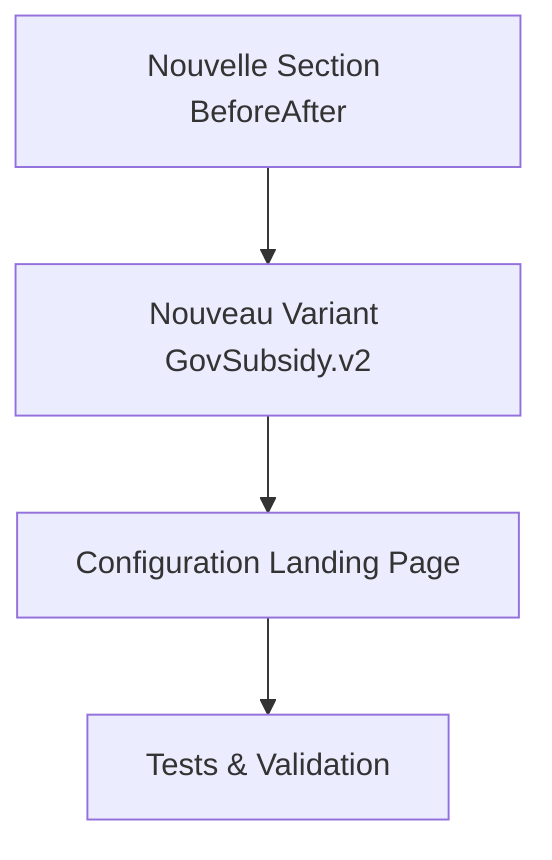

# Manuel de Procédures - Ajout de Nouvelles Landing Pages

## Table des Matières
1. Vue d'Ensemble des Procédures
2. Cas 1 : Landing Page avec Sections Existantes
3. Cas 2 : Landing Page avec Nouveaux Variants
4. Cas 3 : Landing Page avec Nouvelles Sections
5. Cas 4 : Landing Page Hybride (Mix des Cas)
6. Procédures de Validation et Tests
7. Déploiement et Mise en Production
8. Troubleshooting et Debugging

---

## 1. Vue d'Ensemble des Procédures

### Contexte
Vous devez créer une nouvelle landing page pour un **thème existant** (PACFR, ITEFR, ou PV). Cette landing page peut nécessiter :
- Réutilisation de sections existantes ✅
- Création de nouveaux variants de sections 🔄
- Création de nouvelles sections complètement 🆕

### Matrix de Décision

| Besoin | Effort | Temps | Complexité |
|--------|---------|-------|------------|
| **Sections existantes** | Minimal (1h) | ⭐ | Configuration uniquement |
| **Nouveaux variants** | Moyen (4-8h) | ⭐⭐ | Composant UI + Factory |
| **Nouvelles sections** | Élevé (1-2j) | ⭐⭐⭐ | Architecture complète |

### Structure des Fichiers à Créer

```
src/
├── content/                    # Cas 3 : Nouvelles sections
│   └── [nouvelleSction]/
│       ├── content.v1.ts
│       └── types.ts
├── sections/                   # Cas 2 & 3 : Variants & Sections
│   └── [Section]/
│       ├── [Section].v2.astro  # Cas 2 : Nouveaux variants
│       └── factory.ts          # Mise à jour registry
├── landings/                   # Tous les cas
│   └── [theme]/
│       └── [theme]-v2.ts       # Nouvelle configuration
└── pages/                      # Tous les cas
    └── [theme]/
        └── v2.astro           # Nouvelle page
```

---

## 2. Cas 1 : Landing Page avec Sections Existantes

### Contexte
**Situation** : Vous voulez créer `pacfr-v2` en réutilisant les sections existantes mais dans un ordre différent ou avec des variants différents.

**Exemple** : Landing PACFR V2 qui utilise Header.v2, HeroSection, et GovSubsidy.v1

### Procédure Complète

#### Étape 1 : Analyser les Sections Disponibles

```bash
# Lister toutes les sections disponibles
ls src/sections/
# Output : Header/ GovSubsidy/ HeroSection.astro ReviewsCarousel.astro

# Vérifier les variants disponibles pour chaque section
cat src/sections/Header/factory.ts | grep -A 5 "VariantsRegistry"
cat src/sections/GovSubsidy/factory.ts | grep -A 5 "VariantsRegistry"
```

**Documentation des sections disponibles** :
```typescript
// Inventaire actuel (exemple)
const sectionsInventory = {
    // Sections complexes (avec variants)
    Header: ["v1", "v2"],
    GovSubsidy: ["v1"],
    
    // Sections simples (sans variants)
    HeroSection: ["default"],
    ReviewsCarousel: ["default"]
};
```

#### Étape 2 : Créer la Configuration de Landing

```typescript
// src/landings/pacfr/pacfr-v2.ts
export const pacfrV2LandingConfig = {
    meta: {
        title: "PACFR V2 - Aides Rénovation Énergétique - Nouvelle Version",
        description: "Découvrez notre nouvelle approche pour vos aides de rénovation",
        canonical: "/pacfr/v2"
    },
    
    // 🎯 Configuration des sections
    sections: [
        { 
            name: "Header", 
            theme: "pacfr", 
            variant: "v2"        // ← Utilise le variant v2 existant
        },
        { 
            name: "HeroSection"   // ← Section simple, pas de variant
        },
        { 
            name: "GovSubsidy", 
            theme: "pacfr", 
            variant: "v1"        // ← Réutilise le variant v1
        },
        { 
            name: "ReviewsCarousel" 
        }
    ],
    
    // 🎨 Configuration optionnelle
    theme: {
        primaryColor: "#1e40af",
        fontFamily: "Inter"
    }
} as const;

// Export du type pour la validation
export type PacfrV2Config = typeof pacfrV2LandingConfig;
```

#### Étape 3 : Créer la Page Astro

```astro
---
// src/pages/pacfr/v2.astro
import Layout from "@layouts/Layout.astro";
import { sectionsRegistry } from "@sections/index";
import { pacfrV2LandingConfig } from "@landings/pacfr/pacfr-v2";

const { meta, sections } = pacfrV2LandingConfig;

// 🔍 Validation des sections (optionnel mais recommandé)
const validateSections = () => {
    sections.forEach(section => {
        if (!sectionsRegistry[section.name]) {
            throw new Error(`Section "${section.name}" not found in registry`);
        }
    });
};

validateSections();
---

<Layout 
    title={meta.title} 
    description={meta.description}
    canonical={meta.canonical}
>
    <main>
        {sections.map((section, index) => {
            const Component = sectionsRegistry[section.name];
            
            return (
                <Component 
                    {...section}
                    key={`section-${index}`}
                    data-section={section.name}
                />
            );
        })}
    </main>
</Layout>
```

#### Étape 4 : Validation et Tests

```bash
# Démarrer le serveur de développement
npm run dev

# Tester la nouvelle page
open http://localhost:4321/pacfr/v2

# Vérifier qu'il n'y a pas d'erreurs TypeScript
npx astro check
```

#### Étape 5 : Configuration de Routing (optionnel)

```typescript
// src/pages/pacfr/index.astro - Redirect vers la version par défaut
---
// Redirection conditionnelle vers v1 ou v2
const searchParams = new URLSearchParams(Astro.url.search);
const version = searchParams.get('v') || '1';

if (version === '2') {
    return Astro.redirect('/pacfr/v2');
}

// Import de la config v1 par défaut
import { pacfrV1LandingConfig } from "@landings/pacfr/pacfr-v1";
---
```

### Temps Estimé : 1-2 heures
### Complexité : ⭐ (Faible)

---

## 3. Cas 2 : Landing Page avec Nouveaux Variants

### Contexte
**Situation** : Vous voulez créer `pacfr-v3` avec un nouveau design pour certaines sections existantes.

**Exemple** : Créer Header.v3 avec un design complètement différent pour tester l'impact sur les conversions.

### Procédure Complète

#### Étape 1 : Analyser le Besoin de Nouveau Variant

```typescript
// Questions à se poser :
// 1. Quelle section a besoin d'un nouveau variant ?
// 2. Le contenu (props) change-t-il ou juste la présentation ?
// 3. Le nouveau variant sera-t-il réutilisé sur d'autres thèmes ?

// Exemple : Header.v3 avec navigation horizontale sticky
const headerV3Requirements = {
    section: "Header",
    changes: [
        "Navigation horizontale au lieu de verticale",
        "Sticky header au scroll", 
        "Logo plus petit",
        "Call-to-action dans le header"
    ],
    propsChanges: [
        "Ajouter ctaText et ctaUrl"  // ← Nouvelles props nécessaires
    ]
};
```

#### Étape 2 : Étendre le Contenu (si nouvelles props nécessaires)

```typescript
// src/content/header/header-content.v1.ts
export const ContentByTheme = {
    pacfr: {
        bannerText: "Jusqu'à 11 500 € d'aides pour vos travaux",
        brandLogo: { name: "PACFR", file: pacfrLogo, className: "h-12" },
        partnerLogos: [/* ... */],
        
        // ✅ Nouvelles données pour le variant v3
        cta: {
            text: "Obtenir mes aides",
            url: "/pacfr/simulation",
            className: "bg-orange-500 hover:bg-orange-600"
        }
    },
    itefr: {
        bannerText: "Isolation thermique extérieure",
        brandLogo: { name: "ITEFR", file: itefrLogo, className: "h-12" },
        partnerLogos: [/* ... */],
        
        // ✅ CTA adapté au thème ITEFR
        cta: {
            text: "Demander un devis",
            url: "/itefr/devis",
            className: "bg-blue-600 hover:bg-blue-700"
        }
    },
    pv: {
        bannerText: "Installation panneaux solaires",
        brandLogo: { name: "PV", file: pvLogo, className: "h-12" },
        partnerLogos: [/* ... */],
        
        // ✅ CTA adapté au thème PV
        cta: {
            text: "Calculer mes économies",
            url: "/pv/simulateur",
            className: "bg-green-600 hover:bg-green-700"
        }
    }
} as const;
```

#### Étape 3 : Créer la Props Factory V3

```typescript
// src/sections/Header/factory.ts

/* --------------------- NOUVEAUX TYPES ---------- */
type HeaderV3Props = {
    bannerText: string;
    brandLogo: Logo;
    partnerLogos: Array<Logo & { visibilityClass: string }>;
    cta: {                              // ← Nouvelles props pour v3
        text: string;
        url: string;
        className: string;
    };
    isSticky: boolean;                  // ← Props calculées par la factory
};

/* --------------------- NOUVELLE FACTORY ---------- */
/**
 * Factory pour Header variant v3 avec CTA et navigation sticky
 * 
 * @param theme - Thème de la landing page
 * @returns Props enrichies pour Header.v3.astro
 */
export const buildV3Props = (theme: Theme): HeaderV3Props => {
    const content = ContentByTheme[theme];
    
    // Réutiliser la logique existante
    const v1Props = buildV1Props(theme);
    
    return {
        ...v1Props,                     // ← Réutiliser les props v1
        cta: content.cta,               // ← Ajouter le CTA
        isSticky: true                  // ← Toujours sticky pour v3
    };
};

/* --------------------- MISE À JOUR DU REGISTRY ---------- */
import V3 from "./Header.v3.astro";

export const VariantsRegistry = {
    v1: { component: V1, propsFactory: buildV1Props },
    v2: { component: V2, propsFactory: buildV2Props },
    v3: { component: V3, propsFactory: buildV3Props },  // ← Nouveau variant
} as const;
```

#### Étape 4 : Créer le Composant UI V3

```astro
---
// src/sections/Header/Header.v3.astro
import { Image } from "astro:assets";

const { 
    brandLogo, 
    partnerLogos, 
    bannerText, 
    cta, 
    isSticky 
} = Astro.props as {
    brandLogo: Logo;
    partnerLogos: Array<Logo & { visibilityClass: string }>;
    bannerText: string;
    cta: { text: string; url: string; className: string };
    isSticky: boolean;
};
---

<!-- V3 : Header avec banner + navigation sticky -->
<header class="relative">
    <!-- Banner top (non-sticky) -->
    <div class="bg-blue-600 text-white px-4 py-2 text-center text-sm">
        {bannerText}
    </div>
    
    <!-- Navigation principale (sticky) -->
    <nav 
        class={`
            bg-white shadow-md z-50 transition-all duration-300
            ${isSticky ? 'sticky top-0' : ''}
        `}
        data-sticky-header
    >
        <div class="container mx-auto px-4 py-3">
            <div class="flex items-center justify-between">
                <!-- Logo (plus petit pour v3) -->
                <div class="flex items-center">
                    <Image 
                        src={brandLogo.file} 
                        alt={brandLogo.name} 
                        class="h-8"  <!-- Réduit de h-12 à h-8 -->
                    />
                </div>
                
                <!-- Navigation horizontale -->
                <div class="hidden md:flex items-center space-x-6">
                    <!-- Logos partenaires intégrés dans la nav -->
                    {partnerLogos.map((logo) => (
                        <div class={`${logo.visibilityClass} items-center`}>
                            <Image 
                                src={logo.file} 
                                alt={logo.name} 
                                class="h-6 opacity-70"
                            />
                        </div>
                    ))}
                </div>
                
                <!-- CTA dans le header (nouveauté v3) -->
                <div>
                    <a 
                        href={cta.url} 
                        class={`
                            px-6 py-2 text-white font-semibold rounded-lg 
                            transition-colors duration-200
                            ${cta.className}
                        `}
                    >
                        {cta.text}
                    </a>
                </div>
            </div>
        </div>
    </nav>
</header>

<!-- Script pour gestion du sticky (optionnel) -->
<script>
    // Ajouter une classe quand le header devient sticky
    const observer = new IntersectionObserver(
        ([entry]) => {
            const header = document.querySelector('[data-sticky-header]');
            if (!entry.isIntersecting) {
                header.classList.add('shadow-lg');
            } else {
                header.classList.remove('shadow-lg');
            }
        },
        { threshold: 0 }
    );
    
    // Observer le banner pour détecter quand on scroll
    const banner = document.querySelector('header > div');
    if (banner) observer.observe(banner);
</script>
```

#### Étape 5 : Créer la Configuration de Landing

```typescript
// src/landings/pacfr/pacfr-v3.ts
export const pacfrV3LandingConfig = {
    meta: {
        title: "PACFR V3 - Aides Rénovation avec Navigation Optimisée",
        description: "Interface repensée pour une meilleure expérience utilisateur",
        canonical: "/pacfr/v3"
    },
    
    sections: [
        { 
            name: "Header", 
            theme: "pacfr", 
            variant: "v3"        // ← Utilise le nouveau variant
        },
        { 
            name: "HeroSection" 
        },
        { 
            name: "GovSubsidy", 
            theme: "pacfr", 
            variant: "v1" 
        }
    ]
} as const;
```

#### Étape 6 : Créer la Page et Tester

```astro
---
// src/pages/pacfr/v3.astro
import Layout from "@layouts/Layout.astro";
import { sectionsRegistry } from "@sections/index";
import { pacfrV3LandingConfig } from "@landings/pacfr/pacfr-v3";

const { meta, sections } = pacfrV3LandingConfig;
---

<Layout title={meta.title} description={meta.description}>
    <main>
        {sections.map((section, index) => {
            const Component = sectionsRegistry[section.name];
            return <Component {...section} key={`section-${index}`} />;
        })}
    </main>
</Layout>
```

#### Étape 7 : Tests A/B Setup

```typescript
// Configuration pour tests A/B
export const pacfrABTestConfig = {
    variants: [
        { 
            name: "control", 
            url: "/pacfr/v1", 
            description: "Header classique vertical" 
        },
        { 
            name: "variant-a", 
            url: "/pacfr/v2", 
            description: "Header gradient horizontal" 
        },
        { 
            name: "variant-b", 
            url: "/pacfr/v3", 
            description: "Header sticky avec CTA" 
        }
    ],
    metrics: [
        "click_cta_header",
        "scroll_depth", 
        "time_on_page",
        "conversion_rate"
    ]
};
```

### Temps Estimé : 4-8 heures
### Complexité : ⭐⭐ (Moyenne)

---

## 4. Cas 3 : Landing Page avec Nouvelles Sections

### Contexte
**Situation** : Vous voulez créer `pacfr-v4` avec une nouvelle section complètement (ex: "TechnicalSpecs" pour détailler les spécifications techniques).

### Procédure Complète

#### Étape 1 : Définir la Nouvelle Section

```typescript
// Cahier des charges de la nouvelle section
const technicalSpecsRequirements = {
    name: "TechnicalSpecs",
    purpose: "Afficher les spécifications techniques par thème",
    content: {
        pacfr: "Normes RT2012, DPE, certifications RGE",
        itefr: "Épaisseur isolation, coefficients thermiques", 
        pv: "Puissance panneaux, onduleurs, garanties"
    },
    variants: ["v1"], // Commencer simple avec un seul variant
    responsive: true,
    animations: false
};
```

#### Étape 2 : Créer la Structure de Contenu

```typescript
// src/content/technicalSpecs/types.ts
export interface TechnicalSpec {
    label: string;
    value: string;
    unit?: string;
    icon?: string;
    description?: string;
}

export interface TechnicalSpecsContent {
    title: string;
    subtitle?: string;
    specs: TechnicalSpec[];
    certifications: Array<{
        name: string;
        logo: any;
        description: string;
    }>;
}

export type Theme = "pacfr" | "itefr" | "pv";
```

```typescript
// src/content/technicalSpecs/content.v1.ts
import rgeLogo from "@assets/certifications/rge.png";
import qualibatLogo from "@assets/certifications/qualibat.png";

export const ContentByTheme: Record<Theme, TechnicalSpecsContent> = {
    pacfr: {
        title: "Spécifications Techniques",
        subtitle: "Normes et certifications pour vos travaux de rénovation",
        specs: [
            {
                label: "Norme RT",
                value: "RT 2012",
                description: "Réglementation thermique en vigueur"
            },
            {
                label: "Gain énergétique",
                value: "30",
                unit: "%",
                description: "Économie moyenne sur facture chauffage"
            },
            {
                label: "Durée des travaux",
                value: "2-5",
                unit: "jours",
                description: "Selon surface à rénover"
            }
        ],
        certifications: [
            {
                name: "RGE",
                logo: rgeLogo,
                description: "Reconnu Garant de l'Environnement"
            },
            {
                name: "Qualibat",
                logo: qualibatLogo,
                description: "Qualification du bâtiment"
            }
        ]
    },
    
    itefr: {
        title: "Spécifications ITE",
        subtitle: "Performances d'isolation thermique extérieure",
        specs: [
            {
                label: "Épaisseur isolant",
                value: "12-20",
                unit: "cm",
                description: "Selon diagnostic thermique"
            },
            {
                label: "Coefficient R",
                value: "3.7-6",
                unit: "m²K/W",
                description: "Résistance thermique minimale"
            },
            {
                label: "Durée de vie",
                value: "25",
                unit: "ans",
                description: "Garantie fabricant"
            }
        ],
        certifications: [
            {
                name: "ACERMI",
                logo: acermiLogo,
                description: "Certification des isolants"
            }
        ]
    },
    
    pv: {
        title: "Spécifications Solaires",
        subtitle: "Performances et garanties panneaux photovoltaïques",
        specs: [
            {
                label: "Puissance crête",
                value: "3-9",
                unit: "kWc",
                description: "Selon surface de toiture"
            },
            {
                label: "Rendement",
                value: "20-22",
                unit: "%",
                description: "Efficacité des panneaux"
            },
            {
                label: "Production annuelle",
                value: "3500-8000",
                unit: "kWh",
                description: "Selon région et orientation"
            }
        ],
        certifications: [
            {
                name: "IEC 61215",
                logo: iecLogo,
                description: "Norme internationale photovoltaïque"
            }
        ]
    }
} as const;
```

#### Étape 3 : Créer la Factory

```typescript
// src/sections/TechnicalSpecs/factory.ts
import { ContentByTheme } from "@content/technicalSpecs/content.v1";
import type { Theme, TechnicalSpecsContent } from "@content/technicalSpecs/types";
import V1 from "./TechnicalSpecs.v1.astro";

/* --------------------- TYPES ---------- */
export type TechnicalSpecsV1Props = {
    title: string;
    subtitle?: string;
    specsGrid: Array<{
        label: string;
        value: string;
        unit?: string;
        description?: string;
        displayValue: string;    // ← Valeur formatée pour affichage
    }>;
    certifications: Array<{
        name: string;
        logo: any;
        description: string;
    }>;
    themeClass: string;         // ← Classe CSS selon le thème
};

/* --------------------- UTILITIES ---------- */
const themeStyles = {
    pacfr: "bg-blue-50 border-blue-200 text-blue-900",
    itefr: "bg-green-50 border-green-200 text-green-900", 
    pv: "bg-yellow-50 border-yellow-200 text-yellow-900"
} as const;

const formatSpecValue = (value: string, unit?: string): string => {
    return unit ? `${value} ${unit}` : value;
};

/* --------------------- PROPS FACTORY ---------- */
/**
 * Factory pour TechnicalSpecs variant v1
 * 
 * @param theme - Thème de la landing page
 * @returns Props enrichies pour TechnicalSpecs.v1.astro
 */
export const buildV1Props = (theme: Theme): TechnicalSpecsV1Props => {
    const content = ContentByTheme[theme];
    
    return {
        title: content.title,
        subtitle: content.subtitle,
        specsGrid: content.specs.map(spec => ({
            ...spec,
            displayValue: formatSpecValue(spec.value, spec.unit)
        })),
        certifications: content.certifications,
        themeClass: themeStyles[theme]
    };
};

/* --------------------- REGISTRY ---------- */
export const VariantsRegistry = {
    v1: { component: V1, propsFactory: buildV1Props }
} as const;

/* --------------------- RESOLVER ---------- */
export const resolveVariant = (variant: string = "v1") => {
    return VariantsRegistry[variant as keyof typeof VariantsRegistry] ?? VariantsRegistry.v1;
};
```

#### Étape 4 : Créer le Composant UI

```astro
---
// src/sections/TechnicalSpecs/TechnicalSpecs.v1.astro
import { Image } from "astro:assets";

const { 
    title, 
    subtitle, 
    specsGrid, 
    certifications, 
    themeClass 
} = Astro.props as {
    title: string;
    subtitle?: string;
    specsGrid: Array<{
        label: string;
        displayValue: string;
        description?: string;
    }>;
    certifications: Array<{
        name: string;
        logo: any;
        description: string;
    }>;
    themeClass: string;
};
---

<section class="py-16 bg-gray-50">
    <div class="container mx-auto px-4">
        <!-- En-tête de section -->
        <div class="text-center mb-12">
            <h2 class="text-3xl font-bold text-gray-900 mb-4">
                {title}
            </h2>
            {subtitle && (
                <p class="text-lg text-gray-600 max-w-2xl mx-auto">
                    {subtitle}
                </p>
            )}
        </div>

        <!-- Grille des spécifications -->
        <div class="grid md:grid-cols-2 lg:grid-cols-3 gap-6 mb-12">
            {specsGrid.map((spec) => (
                <div class={`
                    p-6 rounded-lg border-2 ${themeClass}
                    hover:shadow-lg transition-shadow duration-200
                `}>
                    <div class="text-center">
                        <h3 class="font-semibold text-sm uppercase tracking-wide mb-2">
                            {spec.label}
                        </h3>
                        <div class="text-3xl font-bold mb-2">
                            {spec.displayValue}
                        </div>
                        {spec.description && (
                            <p class="text-sm opacity-80">
                                {spec.description}
                            </p>
                        )}
                    </div>
                </div>
            ))}
        </div>

        <!-- Certifications -->
        {certifications.length > 0 && (
            <div class="text-center">
                <h3 class="text-xl font-semibold mb-6">
                    Certifications & Garanties
                </h3>
                <div class="flex flex-wrap justify-center items-center gap-8">
                    {certifications.map((cert) => (
                        <div class="flex flex-col items-center max-w-32">
                            <Image 
                                src={cert.logo} 
                                alt={cert.name}
                                class="h-16 w-auto mb-2 grayscale hover:grayscale-0 transition-all duration-200"
                            />
                            <span class="text-sm font-medium text-gray-700">
                                {cert.name}
                            </span>
                            <p class="text-xs text-gray-500 text-center mt-1">
                                {cert.description}
                            </p>
                        </div>
                    ))}
                </div>
            </div>
        )}
    </div>
</section>
```

#### Étape 5 : Créer le Resolver

```astro
---
// src/sections/TechnicalSpecs/Resolver.astro
import { resolveVariant } from "./factory";
import { ContentByTheme } from "@content/technicalSpecs/content.v1";

const { theme = "pacfr", variant = "v1" } = Astro.props as {
    theme?: "pacfr" | "itefr" | "pv";
    variant?: string;
};

const content = ContentByTheme[theme];
const { component: Component, propsFactory } = resolveVariant(variant);
const props = propsFactory(theme);
---

<Component {...props} />
```

#### Étape 6 : Créer les Exports Publics

```typescript
// src/sections/TechnicalSpecs/index.ts
export { default as TechnicalSpecsResolver } from "./Resolver.astro";
export { VariantsRegistry as technicalSpecsVariants } from "./factory";
export type { TechnicalSpecsV1Props } from "./factory";
```

#### Étape 7 : Enregistrer dans le Registry Global

```typescript
// src/sections/index.ts
import TechnicalSpecsResolver from "./TechnicalSpecs/Resolver.astro";

export const sectionsRegistry = {
    Header: HeaderResolver,
    GovSubsidy: GovSubsidyResolver,
    TechnicalSpecs: TechnicalSpecsResolver,  // ← Nouvelle section ajoutée
    HeroSection,
    ReviewsCarousel,
} as const;

// Mettre à jour le type pour TypeScript
export type SectionName = keyof typeof sectionsRegistry;
```

#### Étape 8 : Créer la Landing Page V4

```typescript
// src/landings/pacfr/pacfr-v4.ts
export const pacfrV4LandingConfig = {
    meta: {
        title: "PACFR V4 - Aides Rénovation avec Spécifications Techniques",
        description: "Découvrez tous les détails techniques de nos solutions",
        canonical: "/pacfr/v4"
    },
    
    sections: [
        { 
            name: "Header", 
            theme: "pacfr", 
            variant: "v1" 
        },
        { 
            name: "HeroSection" 
        },
        { 
            name: "TechnicalSpecs",     // ← Nouvelle section utilisée
            theme: "pacfr", 
            variant: "v1" 
        },
        { 
            name: "GovSubsidy", 
            theme: "pacfr", 
            variant: "v1" 
        }
    ]
} as const;
```

#### Étape 9 : Créer la Page Finale

```astro
---
// src/pages/pacfr/v4.astro
import Layout from "@layouts/Layout.astro";
import { sectionsRegistry } from "@sections/index";
import { pacfrV4LandingConfig } from "@landings/pacfr/pacfr-v4";

const { meta, sections } = pacfrV4LandingConfig;
---

<Layout title={meta.title} description={meta.description}>
    <main>
        {sections.map((section, index) => {
            const Component = sectionsRegistry[section.name];
            return <Component {...section} key={`section-${index}`} />;
        })}
    </main>
</Layout>
```

### Temps Estimé : 1-2 jours
### Complexité : ⭐⭐⭐ (Élevée)

---

## 5. Cas 4 : Landing Page Hybride (Mix des Cas)

### Contexte
**Situation** : Vous voulez créer `itefr-v2` qui combine :
- Réutilisation de Header.v1 (Cas 1)
- Nouveau variant GovSubsidy.v2 (Cas 2)  
- Nouvelle section "BeforeAfter" (Cas 3)

### Procédure Stratégique

#### Étape 1 : Planification de l'Approche

```typescript
// Plan d'exécution hybride
const itefV2Plan = {
    // Cas 1 : Réutilisation directe
    existingSections: [
        { name: "Header", variant: "v1" },        // ← Réutilise tel quel
        { name: "HeroSection" }                   // ← Section simple
    ],
    
    // Cas 2 : Nouveaux variants
    newVariants: [
        { 
            section: "GovSubsidy", 
            newVariant: "v2",
            changes: ["Layout horizontal", "Icons pour chaque aide"]
        }
    ],
    
    // Cas 3 : Nouvelles sections
    newSections: [
        {
            name: "BeforeAfter",
            purpose: "Galerie avant/après des travaux ITE",
            variants: ["v1"]
        }
    ]
};
```

#### Étape 2 : Ordre d'Exécution Optimal



**Pourquoi cet ordre ?**
1. **Nouvelles sections d'abord** : Plus complexe, risque de blocage
2. **Nouveaux variants ensuite** : Dépendent des sections existantes
3. **Configuration finale** : Assemble le tout
4. **Tests** : Validation globale

#### Étape 3 : Exécution - Nouvelle Section BeforeAfter

```typescript
// src/content/beforeAfter/content.v1.ts
export const ContentByTheme = {
    itefr: {
        title: "Avant / Après nos Réalisations",
        subtitle: "Découvrez la transformation de nos chantiers ITE",
        projects: [
            {
                id: "maison-lyon-2023",
                location: "Lyon, Rhône",
                year: "2023",
                beforeImage: beforeLyon,
                afterImage: afterLyon,
                description: "Isolation complète + ravalement",
                specs: {
                    surface: "180 m²",
                    isolant: "Polystyrène 16cm",
                    economie: "45% sur chauffage"
                }
            }
            // ... autres projets
        ]
    },
    pacfr: {
        title: "Transformations Réussies",
        subtitle: "Exemples de rénovations énergétiques",
        // ... contenu adapté PACFR
    }
    // ... autres thèmes
} as const;
```

#### Étape 4 : Exécution - Nouveau Variant GovSubsidy.v2

```typescript
// src/sections/GovSubsidy/factory.ts - Ajout du variant v2

export type GovSubsidyV2Props = {
    heading: {
        eyebrow: string;
        title: string;
        highlight: string;
    };
    aides: Array<{                       // ← Structure différente pour v2
        nom: string;
        montant: string;
        icon: string;                    // ← Nouveau : icônes
        description: string;
        eligibilite: string[];
    }>;
    videoSrc?: string;
    layoutHorizontal: boolean;           // ← Nouveau : layout horizontal
};

export const buildV2Props = (theme: Theme): GovSubsidyV2Props => {
    const content = ContentByTheme[theme];
    
    // Transformation spécifique v2 : restructurer en aides individuelles
    const aides = extractAidesFromParagraphs(content.paragraphs);
    
    return {
        heading: {
            eyebrow: content.eyebrow,
            title: content.title,
            highlight: content.highlight
        },
        aides: aides.map(aide => ({
            ...aide,
            icon: getAideIcon(aide.type)     // ← Fonction helper pour les icônes
        })),
        videoSrc: content.videoId ? `https://youtube.com/embed/${content.videoId}` : undefined,
        layoutHorizontal: true
    };
};

// Mise à jour du registry
export const VariantsRegistry = {
    v1: { component: V1, propsFactory: buildV1Props },
    v2: { component: V2, propsFactory: buildV2Props },  // ← Nouveau variant
} as const;
```

#### Étape 5 : Configuration Finale Landing ITEFR V2

```typescript
// src/landings/itefr/itefr-v2.ts
export const itefrV2LandingConfig = {
    meta: {
        title: "ITE France V2 - Isolation Thermique avec Galerie Projets",
        description: "Découvrez nos réalisations et nos solutions d'aide",
        canonical: "/itefr/v2"
    },
    
    sections: [
        // Cas 1 : Réutilisation existante
        { 
            name: "Header", 
            theme: "itefr", 
            variant: "v1"           // ← Existant
        },
        { 
            name: "HeroSection"     // ← Section simple
        },
        
        // Cas 3 : Nouvelle section
        { 
            name: "BeforeAfter", 
            theme: "itefr", 
            variant: "v1"           // ← Nouveau
        },
        
        // Cas 2 : Nouveau variant
        { 
            name: "GovSubsidy", 
            theme: "itefr", 
            variant: "v2"           // ← Nouveau variant
        }
    ]
} as const;
```

#### Étape 6 : Tests par Couches

```bash
# Test 1 : Nouvelle section isolée
curl http://localhost:4321/test-beforeafter

# Test 2 : Nouveau variant isolé  
curl http://localhost:4321/test-govsubsidy-v2

# Test 3 : Landing page complète
curl http://localhost:4321/itefr/v2

# Test 4 : Validation TypeScript
npx astro check
```

### Temps Estimé : 2-3 jours
### Complexité : ⭐⭐⭐ (Élevée)

---

## 6. Procédures de Validation et Tests

### 6.1 Tests de Développement

#### Tests Unitaires des Props Factories

```typescript
// tests/sections/Header/factory.test.ts
import { describe, it, expect } from 'vitest';
import { buildV1Props, buildV3Props } from '@sections/Header/factory';

describe('Header Props Factories', () => {
    it('should build V1 props for PACFR theme', () => {
        const props = buildV1Props('pacfr');
        
        expect(props.bannerText).toContain('11 500');
        expect(props.brandLogo.name).toBe('PACFR');
        expect(props.partnerLogos).toBeInstanceOf(Array);
        expect(props.partnerLogos[0]).toHaveProperty('visibilityClass');
    });
    
    it('should build V3 props with CTA', () => {
        const props = buildV3Props('pacfr');
        
        expect(props.cta).toBeDefined();
        expect(props.cta.text).toBeTruthy();
        expect(props.cta.url).toMatch(/^\/pacfr\//);
        expect(props.isSticky).toBe(true);
    });
});
```

#### Tests d'Intégration des Sections

```typescript
// tests/sections/integration.test.ts
import { sectionsRegistry } from '@sections/index';

describe('Sections Registry Integration', () => {
    it('should have all required sections', () => {
        const requiredSections = ['Header', 'GovSubsidy', 'HeroSection'];
        
        requiredSections.forEach(sectionName => {
            expect(sectionsRegistry[sectionName]).toBeDefined();
        });
    });
    
    it('should resolve variants correctly', async () => {
        // Test que chaque section résout ses variants
        // ... tests d'intégration
    });
});
```

### 6.2 Tests Visuels et Fonctionnels

#### Checklist de Validation Manuelle

```markdown
## Checklist Validation Landing Page

### 📱 Responsive Design
- [ ] Mobile (320-767px) : Layout correct
- [ ] Tablet (768-1023px) : Éléments bien disposés  
- [ ] Desktop (1024px+) : Expérience optimale

### 🎨 Cohérence Visuelle
- [ ] Couleurs thème respectées
- [ ] Typographie cohérente
- [ ] Espacements uniformes
- [ ] Animations fluides (si applicables)

### 🔗 Navigation & Liens
- [ ] Tous les liens fonctionnent
- [ ] CTAs mènent aux bonnes pages
- [ ] Navigation sticky (si applicable)
- [ ] Liens externes s'ouvrent dans nouveau tab

### ⚡ Performance
- [ ] Temps de chargement < 3s
- [ ] Images optimisées
- [ ] Fonts chargées efficacement
- [ ] Pas d'erreurs console

### 🔍 SEO & Meta
- [ ] Title tag correct et unique
- [ ] Meta description présente
- [ ] Balises H1, H2, H3 structurées
- [ ] Alt text sur toutes les images

### 📊 Analytics & Tracking
- [ ] Google Analytics configuré
- [ ] Pixels Facebook/LinkedIn (si applicable)
- [ ] Events de conversion trackés
- [ ] Tests A/B configurés (si applicable)
```

#### Tests Automatisés avec Playwright

```typescript
// tests/e2e/landing-pages.spec.ts
import { test, expect } from '@playwright/test';

test.describe('PACFR Landing Pages', () => {
    test('V1 should load correctly', async ({ page }) => {
        await page.goto('/pacfr/v1');
        
        // Vérifier que les sections principales sont présentes
        await expect(page.locator('header')).toBeVisible();
        await expect(page.locator('main')).toBeVisible();
        
        // Vérifier le contenu spécifique PACFR
        await expect(page.locator('text=11 500')).toBeVisible();
        await expect(page.locator('img[alt="PACFR"]')).toBeVisible();
    });
    
    test('V3 sticky header should work', async ({ page }) => {
        await page.goto('/pacfr/v3');
        
        // Vérifier que le header devient sticky au scroll
        await page.evaluate(() => window.scrollTo(0, 200));
        
        const header = page.locator('[data-sticky-header]');
        await expect(header).toHaveClass(/sticky/);
    });
});
```

### 6.3 Tests de Performance

#### Lighthouse CI Configuration

```javascript
// .lighthouserc.js
module.exports = {
    ci: {
        collect: {
            url: [
                'http://localhost:4321/pacfr/v1',
                'http://localhost:4321/pacfr/v2', 
                'http://localhost:4321/pacfr/v3',
                'http://localhost:4321/itefr/v1',
                'http://localhost:4321/pv/v1'
            ],
            numberOfRuns: 3
        },
        assert: {
            assertions: {
                'categories:performance': ['error', {minScore: 0.8}],
                'categories:accessibility': ['error', {minScore: 0.9}],
                'categories:best-practices': ['error', {minScore: 0.9}],
                'categories:seo': ['error', {minScore: 0.9}]
            }
        }
    }
};
```

---

## 7. Déploiement et Mise en Production

### 7.1 Processus de Déploiement

#### Pré-déploiement

```bash
# 1. Build de production
npm run build

# 2. Vérification des erreurs
npx astro check

# 3. Tests automatisés
npm run test

# 4. Audit de performance
npm run lighthouse

# 5. Vérification des liens
npm run check-links
```

#### Configuration du Déploiement

```yaml
# .github/workflows/deploy.yml
name: Deploy Landing Pages

on:
  push:
    branches: [main]
    paths: 
      - 'src/landings/**'
      - 'src/sections/**'
      - 'src/content/**'

jobs:
  deploy:
    runs-on: ubuntu-latest
    steps:
      - uses: actions/checkout@v3
      
      - name: Setup Node.js
        uses: actions/setup-node@v3
        with:
          node-version: '18'
          cache: 'npm'
      
      - name: Install dependencies
        run: npm ci
      
      - name: Run tests
        run: npm run test
      
      - name: Build
        run: npm run build
      
      - name: Deploy to production
        run: npm run deploy
        env:
          DEPLOY_TOKEN: ${{ secrets.DEPLOY_TOKEN }}
```

### 7.2 Monitoring Post-Déploiement

#### Health Checks

```typescript
// scripts/health-check.ts
const landingPages = [
    'https://example.com/pacfr/v1',
    'https://example.com/pacfr/v2',
    'https://example.com/itefr/v1'
];

async function checkLandingPage(url: string) {
    try {
        const response = await fetch(url);
        const html = await response.text();
        
        // Vérifications basiques
        const checks = {
            status: response.status === 200,
            hasTitle: html.includes('<title>'),
            hasMainContent: html.includes('<main>'),
            hasHeader: html.includes('<header>'),
            noErrors: !html.includes('Error:')
        };
        
        return { url, ...checks, success: Object.values(checks).every(Boolean) };
    } catch (error) {
        return { url, success: false, error: error.message };
    }
}

// Exécuter les vérifications
Promise.all(landingPages.map(checkLandingPage))
    .then(results => {
        const failed = results.filter(r => !r.success);
        if (failed.length > 0) {
            console.error('❌ Failed health checks:', failed);
            process.exit(1);
        }
        console.log('✅ All landing pages healthy');
    });
```

### 7.3 Rollback et Gestion d'Incidents

#### Procédure de Rollback

```bash
# 1. Identifier la version précédente stable
git log --oneline --grep="deploy:" | head -5

# 2. Checkout sur la version stable
git checkout [commit-hash]

# 3. Redéploiement d'urgence
npm run build
npm run deploy:emergency

# 4. Notification équipe
slack-notify "🚨 Rollback effectué sur les landing pages"
```

#### Monitoring et Alertes

```typescript
// monitoring/alerts.ts
export const alertsConfig = {
    performance: {
        metric: 'page_load_time',
        threshold: 3000, // 3s
        action: 'slack_notification'
    },
    errors: {
        metric: '5xx_errors',
        threshold: 5, // 5 erreurs en 5min
        action: 'pager_duty'
    },
    conversion: {
        metric: 'conversion_rate',
        threshold: -20, // -20% par rapport baseline
        action: 'email_team'
    }
};
```

---

## 8. Troubleshooting et Debugging

### 8.1 Problèmes Courants et Solutions

#### Erreur : "Component not found in registry"

```typescript
// ❌ Erreur
const Component = sectionsRegistry[sectionName]; // undefined

// ✅ Solution : Vérifier l'enregistrement
// src/sections/index.ts
export const sectionsRegistry = {
    Header: HeaderResolver,
    GovSubsidy: GovSubsidyResolver,
    NewSection: NewSectionResolver,  // ← Vérifier que c'est ajouté
} as const;

// Debug utile
console.log('Available sections:', Object.keys(sectionsRegistry));
console.log('Requested section:', sectionName);
```

#### Erreur : "Props factory returns undefined"

```typescript
// ❌ Problème dans la factory
export const buildV1Props = (theme: Theme) => {
    const content = ContentByTheme[theme]; // ← undefined si thème inexistant
    return {
        title: content.title // ← Erreur ici
    };
};

// ✅ Solution : Validation et fallback
export const buildV1Props = (theme: Theme) => {
    const content = ContentByTheme[theme];
    
    if (!content) {
        console.warn(`⚠️ No content found for theme: ${theme}`);
        console.log('Available themes:', Object.keys(ContentByTheme));
        
        // Fallback vers pacfr
        return buildV1Props('pacfr');
    }
    
    return {
        title: content.title
    };
};
```

#### Erreur : "Variant not found"

```typescript
// ❌ Variant inexistant demandé
const { component, propsFactory } = resolveVariant('v5'); // n'existe pas

// ✅ Solution : Debug dans le resolver
export const resolveVariant = (variant: string = "v1") => {
    const available = Object.keys(VariantsRegistry);
    
    if (!VariantsRegistry[variant]) {
        console.warn(`⚠️ Variant "${variant}" not found`);
        console.log('Available variants:', available);
        console.log('Falling back to v1');
    }
    
    return VariantsRegistry[variant] ?? VariantsRegistry.v1;
};
```

### 8.2 Debugging Tools et Techniques

#### Dev Tools pour Landing Pages

```typescript
// utils/debug.ts - Utilitaires de debugging
export const debugLandingPage = (config: LandingConfig) => {
    console.group('🔍 Landing Page Debug');
    
    // Vérifier que toutes les sections existent
    config.sections.forEach((section, index) => {
        const exists = sectionsRegistry[section.name];
        const status = exists ? '✅' : '❌';
        console.log(`${status} Section ${index}: ${section.name}`, section);
    });
    
    // Vérifier les thèmes
    const themes = config.sections
        .filter(s => s.theme)
        .map(s => s.theme);
    console.log('🎨 Themes used:', [...new Set(themes)]);
    
    // Vérifier les variants
    const variants = config.sections
        .filter(s => s.variant)
        .map(s => `${s.name}.${s.variant}`);
    console.log('🔄 Variants used:', variants);
    
    console.groupEnd();
};

// Usage dans la page
// debugLandingPage(pacfrV3LandingConfig);
```

#### Component Inspector

```astro
---
// components/DevTools.astro - Composant debug (dev uniquement)
const isDev = import.meta.env.DEV;
const { sectionName, variant, theme, props } = Astro.props;
---

{isDev && (
    <div class="fixed bottom-4 right-4 bg-black text-white p-2 text-xs rounded opacity-50 hover:opacity-100 z-50">
        <div><strong>{sectionName}</strong></div>
        {variant && <div>Variant: {variant}</div>}
        {theme && <div>Theme: {theme}</div>}
        <details>
            <summary>Props</summary>
            <pre class="text-xs max-w-xs overflow-auto">
                {JSON.stringify(props, null, 2)}
            </pre>
        </details>
    </div>
)}
```

### 8.3 Logs et Monitoring

#### Structured Logging

```typescript
// utils/logger.ts
type LogLevel = 'debug' | 'info' | 'warn' | 'error';

interface LogEntry {
    timestamp: string;
    level: LogLevel;
    section?: string;
    theme?: string;
    variant?: string;
    message: string;
    data?: any;
}

export const logger = {
    debug: (message: string, data?: any) => log('debug', message, data),
    info: (message: string, data?: any) => log('info', message, data),
    warn: (message: string, data?: any) => log('warn', message, data),
    error: (message: string, data?: any) => log('error', message, data),
};

function log(level: LogLevel, message: string, data?: any) {
    const entry: LogEntry = {
        timestamp: new Date().toISOString(),
        level,
        message,
        ...(data && { data })
    };
    
    console[level](`[${entry.timestamp}] ${level.toUpperCase()}: ${message}`, data || '');
    
    // En production, envoyer vers service de monitoring
    if (import.meta.env.PROD) {
        sendToMonitoring(entry);
    }
}

// Usage dans les factories
export const buildV1Props = (theme: Theme) => {
    logger.debug('Building V1 props', { theme });
    
    try {
        const content = ContentByTheme[theme];
        const props = { /* ... */ };
        
        logger.info('Props built successfully', { theme, propsKeys: Object.keys(props) });
        return props;
    } catch (error) {
        logger.error('Failed to build props', { theme, error: error.message });
        throw error;
    }
};
```

---

## Conclusion et Bonnes Pratiques

### Récapitulatif des Procédures

| Cas | Complexité | Temps | Fichiers Modifiés |
|-----|------------|-------|------------------|
| **Sections existantes** | ⭐ | 1-2h | Landing config + Page |
| **Nouveaux variants** | ⭐⭐ | 4-8h | Factory + Composant + Config |
| **Nouvelles sections** | ⭐⭐⭐ | 1-2j | Content + Section complète |
| **Hybride** | ⭐⭐⭐ | 2-3j | Mix des approches |

### Bonnes Pratiques Essentielles

#### ✅ Planification
- **Analyser le besoin** avant de coder
- **Réutiliser** au maximum l'existant
- **Tester** chaque étape individuellement

#### ✅ Code Quality
- **Types TypeScript** stricts pour toutes les props
- **JSDoc** complète sur les factories
- **Tests unitaires** sur la logique métier

#### ✅ Performance
- **Optimiser les images** dans le content
- **Lazy loading** pour les sections non-critiques
- **Bundle splitting** par landing page

#### ✅ Maintenance
- **Documentation** des décisions architecturales
- **Monitoring** des métriques business
- **Rollback** facile en cas de problème

### Prochaines Améliorations

1. **Générateur de code** : Scripts pour créer automatiquement nouvelles sections
2. **CMS Integration** : Interface admin pour gérer le contenu sans code
3. **A/B Testing** : Framework intégré pour tests automatisés
4. **Internationalisation** : Support multi-langues natif
5. **Performance Budget** : Limites automatiques de taille/temps

---

Cette approche méthodique garantit la création de landing pages robustes, maintenables et performantes tout en respectant l'architecture existante. 🚀